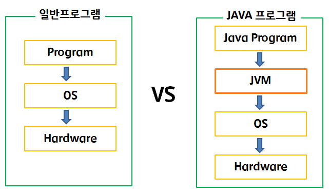

## 1. 리터럴
- 변수의 초기값은 코드에서 직접 입력하는 경우가 많은데, 소스코드 내에서 직접 입력된 값을 리터럴(literal)이라고 부른다. 
- 리터럴은 값의 종류에 따라 정수 리터럴, 실수 리터럴, 문자 리터럴, 논리 리터럴로 구분된다.

  

## 2. 데이터 타입  
#### 2-1. 기본타입과 참조타입
- 기본 타입(primitive type)이란 정수, 실수, 문자, 논리 리터럴을 저장하는 타입
- 참조 타입(reference type)이란 객체(Object)의 번지를 참조하는 타입으로 배열, 열거, 클래스, 인터페이스 타입을 말한다.
- 기본 타입인 byte, char, short, int, long, float, double, boolean을 이용해서 선언된 변수는 실제값을 변수 안에 저장하지만, 참조 타입인 배열, 열거, 클래스, 인터페이스를 이용해서 선언된 변수는 메모리의 번지를 값으로 갖는다. 번지를 통해 객체를 참조한다는 뜻에서 참조 타입이라고 부른다.  

  

## 3. JVM 메모리 구조
- 프로그램이 실행되기 위해서는 windows나 linux와 같은 운영체제가 제어하고 있는 시스템의 리소스의 일부인 메모리(RAM:주기억장치)를 제어할 수 있어야 하는데, java 이전의 c같은 대부분의 언어로 만들어진 프로그램은 이러한 이유 때문에 OS에 종속되어 실행되게 되어 있었다.
- java 프로그램은 JVM(Java Virtual Machine: 자바가상머신)이라는 프로그램만 있으면 실행이 가능한데, JVM이 OS에게서 메모리 사용권한을 할당 받고 JVM이 자바프로그램을 호출하여 실행하게 된다. OS에게는 독립되었지만 JVM이라는 프로그램에는 종속적이게 된다.
 

#### 3-1. 메소드(Method)영역
- 메소드 영역에는 코드에서 사용되는 클래스(~.class)들을 클래스 로더로 읽어 클래스별 런타임 상수풀(runtime constant pool), 필드(field)데이터, 메소드(method)데이터, 메소드 코드, 생성자(constructor)코드 등을 분류해서 저장한다.
- 메소드 영역은 JVM이 시작될 때 생성되고 모든 스레드가 공유하는 영역이다.

---
#### 참고
[이것이 자바다 신용권의 Java 프로그래밍 정복]()  
[어떤공간님의 JVM 메모리구조](http://huelet.tistory.com/entry/JVM-%EB%A9%94%EB%AA%A8%EB%A6%AC%EA%B5%AC%EC%A1%B0)  
